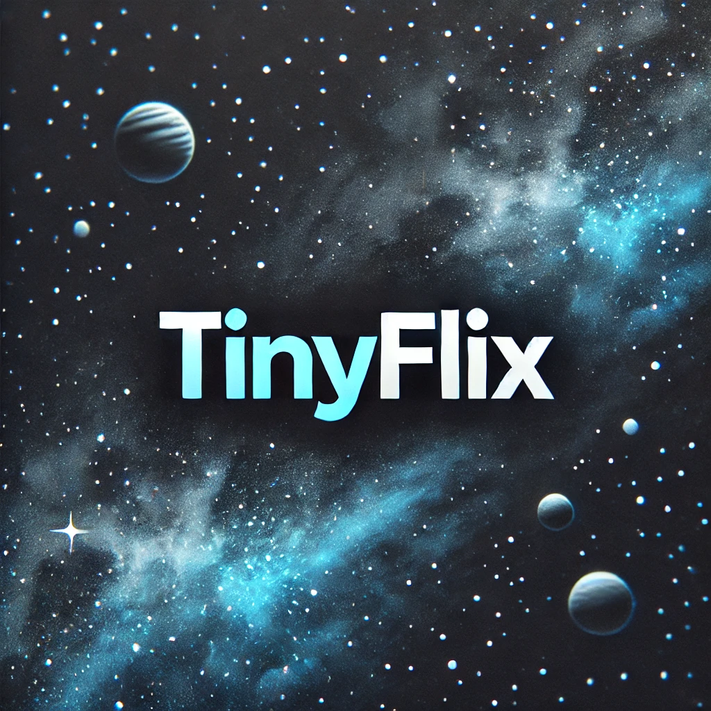
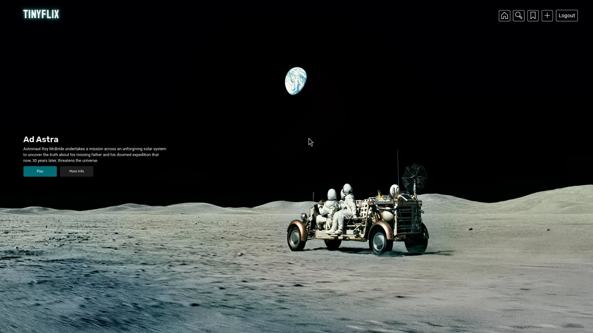
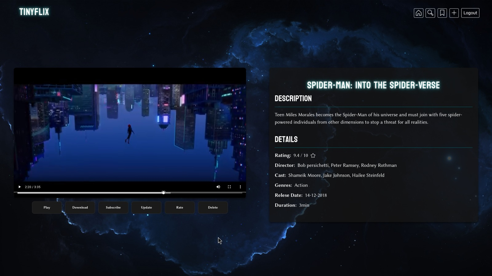
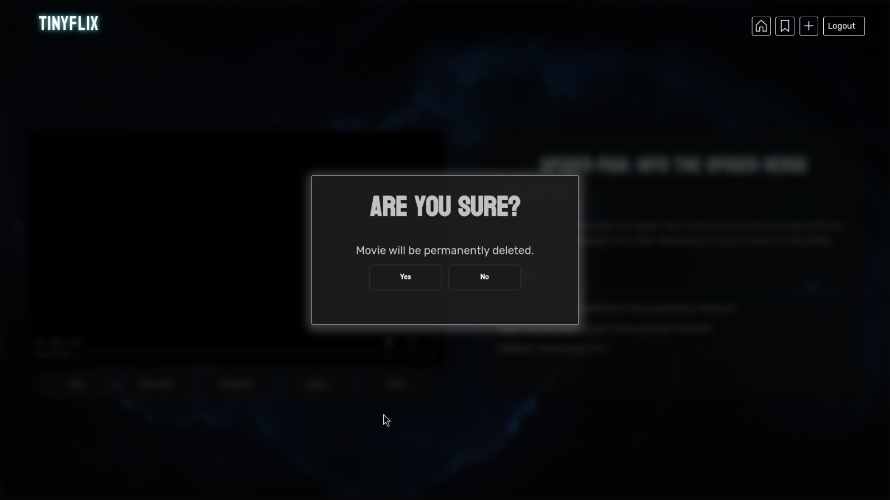
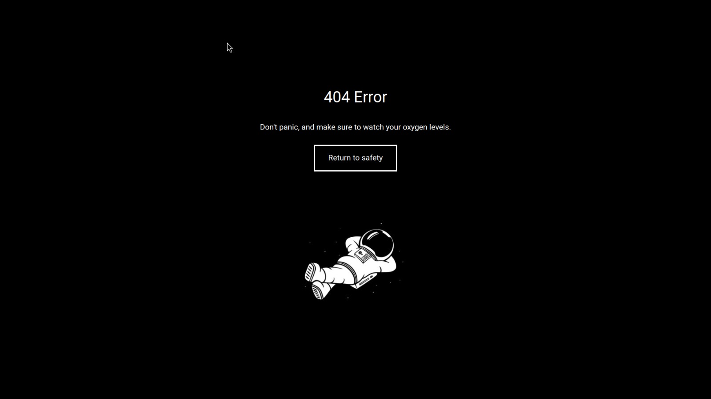
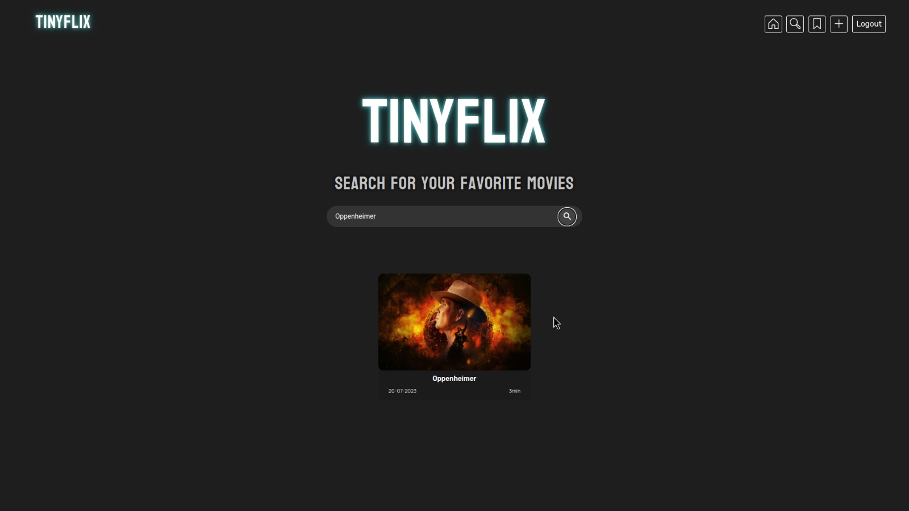
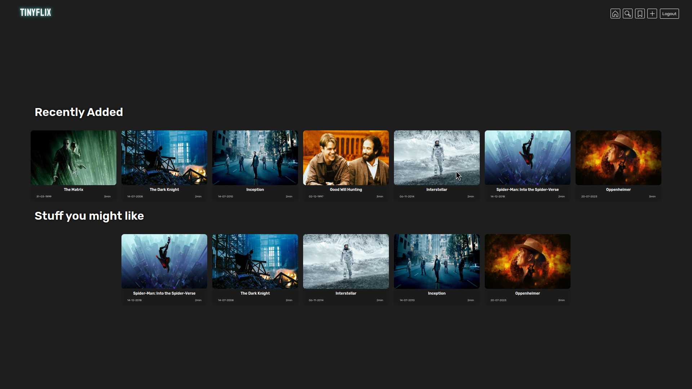
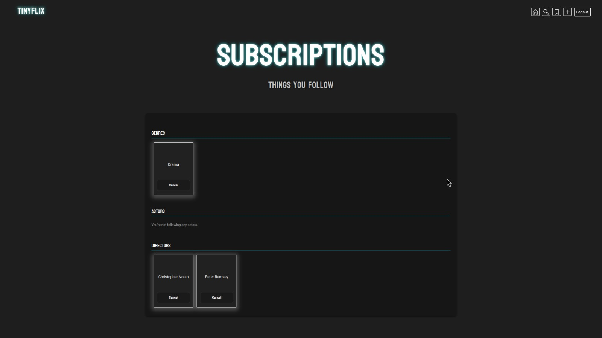

<h1 align="center"> TinyFlix </h1>

TinyFlix is a Netflix clone for storing and managing movie content, developed using AWS cloud services and following a cloud-native architecture.

## Prerequisites

Before you get started with TinyFlix, make sure you have the following prerequisites installed on your system:

- Git
- Python
- AWS CLI configured with your credentials

# Key Features

- **Administrator:**
  - Add, edit, and delete movie content.
- **Regular User:**
  - Register, log in, search, view, rate, and subscribe to movie content.
  - Manage subscriptions and receive personalized content recommendations.
- **System:**
  - Transcode movies into different resolutions.

## Components

- **Client Application:** User interface.
- **Server Application:** Manages business logic and AWS services.

## Requirements

- Cloud-native architecture.
- Efficient search and performance.
- Infrastructure as Code (IaC).
- API Gateway integration.

## Gallery

